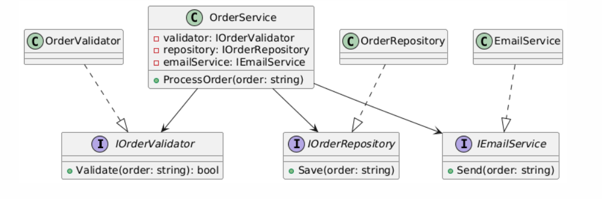

# Самостійна робота №16

## Тема
Схема розподілу відповідальностей модуля.

## Мета роботи
Навчитися застосовувати принцип єдиної відповідальності (Single Responsibility Principle, SRP) для декомпозиції складного модуля на менші, більш сфокусовані класи, а також ознайомитися з принципом інверсії залежностей (DIP) і візуалізацією структури програми за допомогою UML-діаграми класів.

---

## Теоретичні відомості

Принцип єдиної відповідальності (SRP) є одним з основних принципів об’єктно-орієнтованого програмування. Згідно з ним, кожен клас повинен мати лише одну причину для зміни, тобто відповідати лише за одну функціональність.

Декомпозиція дозволяє розбивати складні модулі на менші компоненти, що підвищує читабельність коду, полегшує його підтримку та тестування.

UML-діаграма класів використовується для графічного представлення структури програми, її класів, інтерфейсів, методів та взаємозв’язків між ними.

---

## Опис виконання роботи

У ході виконання роботи було створено консольний проєкт **IndependentWork16**.

Спочатку було реалізовано клас `OrderProcessor`, який порушує принцип SRP, оскільки поєднує в собі кілька відповідальностей:
- валідацію замовлення;
- збереження замовлення в базу даних;
- відправку email-сповіщень.

Далі було виконано рефакторинг цього класу. Функціональність було розділено на окремі інтерфейси:
- `IOrderValidator` — відповідає за валідацію замовлення;
- `IOrderRepository` — відповідає за збереження даних;
- `IEmailService` — відповідає за відправку email-повідомлень.

Клас `OrderService` реалізує логіку обробки замовлення та залежить лише від абстракцій (інтерфейсів), що відповідає принципу інверсії залежностей (DIP).

Для кожного інтерфейсу було створено прості реалізації-загВЕлушки, які імітують роботу відповідних компонентів.

---

## UML-діаграма

Для візуалізації архітектури програми було створено UML-діаграму класів, яка відображає:
- інтерфейси `IOrderValidator`, `IOrderRepository`, `IEmailService`;
- їх реалізації;
- клас `OrderService` та зв’язки між компонентами.

Діаграма створена за допомогою PlantUML та збережена у вигляді зображення.

---

## Демонстрація роботи програми

У методі `Main` було продемонстровано:
- роботу класу `OrderProcessor`, який порушує SRP;
- роботу рефакторингової версії з використанням `OrderService`.

Результати виконання програми виводяться в консоль.

---

## Висновок

Під час виконання самостійної роботи було досліджено принцип єдиної відповідальності та виконано рефакторинг класу, який його порушував.  
Застосування SRP та DIP дозволило отримати більш гнучку, зрозумілу та розширювану архітектуру програми, що відповідає принципам об’єктно-орієнтованого програмування.

## Контрольні питання

### 1. Поясніть принцип єдиної відповідальності (SRP). Чому він важливий для проектування?

Принцип єдиної відповідальності (Single Responsibility Principle, SRP) полягає в тому, що кожен клас повинен відповідати лише за одну функціональність і мати лише одну причину для зміни.  
Дотримання SRP є важливим, оскільки воно підвищує читабельність коду, спрощує його підтримку та тестування, а також зменшує залежності між компонентами системи.

---

### 2. Що таке “God Object” і як він порушує SRP?

“God Object” — це клас, який зосереджує в собі занадто багато логіки та відповідальностей. Такий клас зазвичай керує більшістю процесів у системі, що призводить до низької зв’язності та високої залежності інших компонентів від нього.  
God Object порушує SRP, оскільки має багато причин для зміни, що ускладнює його модифікацію та супровід.

---

### 3. Як декомпозиція допомагає дотримуватися SRP? Наведіть приклад.

Декомпозиція полягає у розбитті складного модуля на менші, незалежні компоненти, кожен з яких виконує одну чітко визначену функцію.  
Наприклад, замість одного класу, який виконує валідацію замовлення, збереження даних і відправку повідомлень, ці функції можна винести в окремі класи: валідатор, репозиторій та сервіс сповіщень. Це дозволяє кожному класу відповідати лише за одну відповідальність.

---

### 4. Як діаграми класів (UML) допомагають візуалізувати та аналізувати розподіл відповідальностей?

Діаграми класів UML дозволяють наочно відобразити структуру програми, показати класи, інтерфейси, їх методи та взаємозв’язки.  
За допомогою UML-діаграм легко визначити, які класи мають надмірну кількість відповідальностей, а також оцінити правильність декомпозиції та відповідність принципу SRP.
