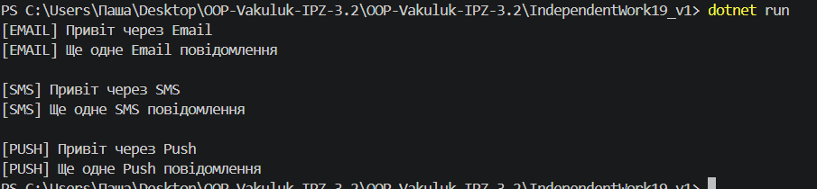

# Самостійна робота №19

## Тема: Фабрики + Singleton: заміна без змін клієнта

## Мета роботи

Навчитися застосовувати патерни Factory Method та Singleton для створення гнучкої системи, де клієнтський код залежить від абстракцій, а не від конкретних реалізацій. Це дозволяє легко змінювати компоненти без зміни клієнта.

## Теоретичні відомості

### Factory Method

Патерн, який визначає інтерфейс для створення об’єктів, але дозволяє підкласам вирішувати, який саме клас створювати.
Сприяє слабкій зв’язаності та дотриманню принципу відкритості/закритості (OCP).

### Singleton

Патерн, який гарантує існування лише одного екземпляра класу та надає глобальну точку доступу до нього.

### Dependency Inversion Principle (DIP)

Модулі високого рівня не повинні залежати від модулів низького рівня. Обидва повинні залежати від абстракцій.

## Опис реалізації

Було реалізовано систему сповіщень, яка підтримує різні способи відправки повідомлень:

* Email
* SMS
* Push

### Основні компоненти

#### Інтерфейс

INotificationSender — містить метод Send(string message).

#### Реалізації

EmailSender, SmsSender, PushSender — реалізують різні способи відправки повідомлень.

#### Фабрика

Абстрактний клас NotificationSenderFactory:

* метод CreateSender() створює об’єкт відправника
* метод SendMessage() використовує створений об’єкт

#### Конкретні фабрики

EmailSenderFactory, SmsSenderFactory, PushSenderFactory — створюють відповідні типи відправників.

#### Singleton

Клас NotificationService:

* має єдиний екземпляр
* дозволяє змінювати фабрику через SetFactory()
* делегує відправку повідомлень

## Демонстрація роботи

У методі Main:

1. Отримано екземпляр NotificationService
2. Послідовно встановлено фабрики:

   * Email
   * SMS
   * Push
3. Для кожної фабрики виконано відправку повідомлень

## Висновок

У ході виконання роботи було реалізовано патерни Factory Method та Singleton. Система побудована відповідно до принципу Dependency Inversion, що дозволяє змінювати реалізації без впливу на клієнтський код. Архітектура є гнучкою та легко розширюваною.

