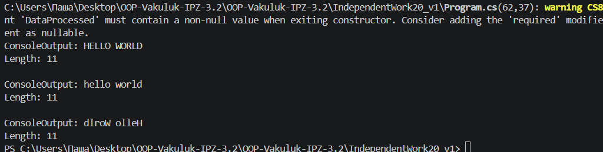

# Самостійна робота №20

## Тема: Strategy + Observer: вибір у рантаймі

## Мета роботи

Навчитися застосовувати патерни Strategy та Observer для створення гнучкої системи, яка дозволяє динамічно змінювати поведінку та автоматично сповіщати залежні об’єкти про зміни.

## Теоретичні відомості

### Strategy

Патерн, який інкапсулює сімейство алгоритмів та робить їх взаємозамінними. Дозволяє змінювати поведінку об’єкта під час виконання.

### Observer

Патерн, який визначає залежність “один-до-багатьох”, де зміна стану одного об’єкта автоматично сповіщає всі залежні об’єкти.

### Події та делегати

У мові C# патерн Observer часто реалізується за допомогою подій (`event`) та делегатів (`Action`).

## Опис реалізації

Було реалізовано систему обробки текстових даних.

### Стратегії обробки:

* UpperCaseStrategy — переводить текст у верхній регістр
* LowerCaseStrategy — переводить текст у нижній регістр
* ReverseStringStrategy — перевертає рядок

### Основні компоненти

#### Інтерфейс

IDataProcessorStrategy — містить метод Process(string data).

#### Реалізації стратегій

Класи UpperCaseStrategy, LowerCaseStrategy, ReverseStringStrategy реалізують різні алгоритми обробки.

#### Контекст

Клас DataContext:

* приймає стратегію через конструктор
* дозволяє змінювати стратегію через SetStrategy()
* виконує обробку через ExecuteProcessing()

#### Publisher (Subject)

Клас DataPublisher:

* містить подію DataProcessed
* викликає її після обробки даних

#### Спостерігачі (Observer)

* ConsoleOutputObserver — виводить результат у консоль
* LengthLoggerObserver — виводить довжину рядка

## Демонстрація роботи

У методі Main:

1. Створено DataPublisher та спостерігачів
2. Спостерігачі підписані на подію DataProcessed
3. Створено DataContext
4. Послідовно встановлено різні стратегії:

   * UpperCase
   * LowerCase
   * Reverse
5. Після кожної обробки викликається подія, яка сповіщає всі спостерігачі

## Висновок

У ході виконання роботи було реалізовано патерни Strategy та Observer. Використання Strategy дозволяє змінювати алгоритми обробки під час виконання програми, а Observer забезпечує автоматичне сповіщення залежних об’єктів. Архітектура системи є гнучкою, розширюваною та відповідає принципам об’єктно-орієнтованого програмування.

