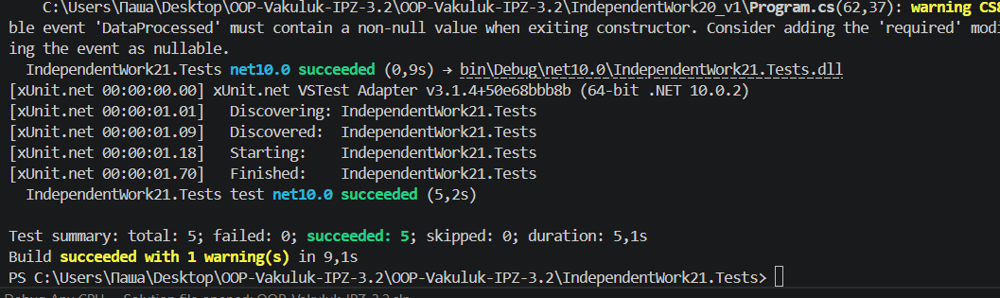

# Звіт про виконання IndependentWork21.Tests

## 1. Загальна інформація
- **Робота:** Самостійна №21  
- **Тема:** Інтеграційні тести патернів (Strategy + Observer)  
- **Проєкт тестів:** `IndependentWork21.Tests`  
- **Проєкт з кодом:** `IndependentWork20_v1`  
- **Команда запуску:** `dotnet test`

---

## 2. Перелік інтеграційних сценаріїв

| № | Сценарій | Тип | Очікуваний результат | Фактичний результат |
|---|----------|-----|----------------------|---------------------|
| 1 | `Strategy_UpperCase_Should_Process_Text` | Позитивний | Рядок `Hello World` перетворюється у `HELLO WORLD` | Відповідає очікуванню |
| 2 | `Strategy_Should_Switch_At_Runtime` | Позитивний | Після зміни стратегії результат змінюється коректно (`hello`, `cba`) | Відповідає очікуванню |
| 3 | `Observer_Should_Notify_Concrete_Subscribers` | Позитивний | Обидва observer отримують подію, у виводі є `ConsoleOutput: TEST` і `Length: 4` | Відповідає очікуванню |
| 4 | `Strategy_Should_Throw_On_Null_Input` | Негативний/граничний | При `null` виникає виняток | Відповідає очікуванню |
| 5 | `Publisher_Should_Not_Throw_Without_Subscribers` | Негативний/граничний | Без підписників подія не викликає виняток | Відповідає очікуванню |

---

## 3. Перевірка взаємодії компонентів

- **Strategy у runtime:** підтверджено (динамічна зміна через `SetStrategy` працює).
- **Observer-підписники:** підтверджено (усі підписники отримують повідомлення).
- **Factory/Singleton:** у поточній реалізації `IndependentWork20_v1` відсутні, тому в `IndependentWork21.Tests` не перевірялись.

---

## 4. Результат

---

## 5. Короткий висновок по ризиках

1. Відсутня обробка `null` у стратегіях на рівні бізнес-логіки (виняток виникає, але не керовано).  
2. Observer з `Console.WriteLine` складніше масштабувати для production-логування.  
3. Якщо вимога №21 обов’язково включає Factory/Singleton, їх потрібно додати в основний проєкт і покрити окремими інтеграційними тестами.

---