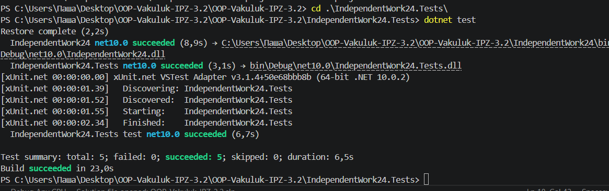

# IndependentWork24 — Технічний звіт

## Інтегровані патерни
- **Composite**: `Folder` + `FileItem` для дерева зберігання.
- **Decorator**: `CompressionDecorator`, `EncryptionDecorator` для динамічної зміни розміру.
- **Proxy**: `CachedSizeProxy` для кешування повторних обчислень.

## Що перевірено тестами
1. Коректне сумування розміру в ієрархії Composite.
2. Коректне застосування кількох Decorator у ланцюжку.
3. Кешування в Proxy (1 miss + подальші hits).
4. Граничний кейс: порожня папка = 0.
5. Негативний кейс: невалідний коефіцієнт компресії -> виняток.

## Компроміси / продуктивність (практичні висновки)
1. Decorator додає гнучкість, але збільшує кількість обгорток і накладні витрати викликів.
2. Proxy дає приріст на повторних запитах, але потребує керування інвалідністю кешу.
3. Composite спрощує роботу з ієрархією, але для дуже глибоких дерев зростає вартість повного обходу.
