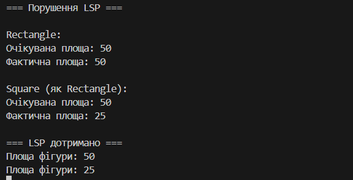

# Лабораторна робота №22

## Тема
LSP: виявлення порушень і альтернативи

## Мета
Поглибити розуміння принципу підстановки Лісков (LSP), навчитися
ідентифікувати його порушення та застосовувати альтернативні підходи
(зміна ієрархії, композиція) для створення коректних рішень.

## Опис початкової ієрархії

Було реалізовано ієрархію класів:

- `Rectangle` — базовий клас з властивостями `Width` та `Height`
- `Square` — похідний клас, який автоматично вирівнює сторони

Клас `Square` наслідує `Rectangle`, але змінює його поведінку.

## Аналіз порушення LSP

Принцип підстановки Лісков стверджує, що об’єкти похідного класу
повинні безпечно замінювати об’єкти базового класу без зміни
коректності програми.

У даній реалізації:

- Клієнтський код очікує, що `Width` та `Height` змінюються незалежно
- У класі `Square` зміна однієї сторони автоматично змінює іншу
- Це порушує контракт базового класу `Rectangle`
- В результаті клієнтський код отримує некоректну площу

Отже, клас `Square` **порушує принцип LSP**.

## Альтернативне рішення (дотримання LSP)

Для вирішення проблеми було застосовано **зміну ієрархії**:

- Відмовились від наслідування `Square : Rectangle`
- Створено спільний інтерфейс `IShape`
- Кожна фігура реалізує власну логіку обчислення площі

Це дозволяє уникнути некоректних очікувань та зберігає LSP.

## Демонстрація коректної роботи

Клієнтський код працює з інтерфейсом `IShape` і коректно обробляє
будь-які геометричні фігури, не знаючи деталей реалізації.

## Висновки

Принцип підстановки Лісков є критично важливим для надійного
об’єктно-орієнтованого проєктування.

Неправильне використання наслідування може призвести до
неочікуваної поведінки програми.

Застосування абстракцій або композиції дозволяє створювати
гнучкі, розширювані та коректні системи.
